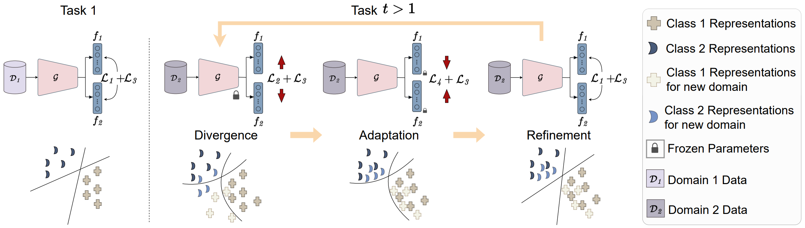

# DARE

This is the official repository of the ICML, 2024 paper "[Gradual Divergence for Seamless Adaptation: A Novel Domain Incremental Learning Method](https://arxiv.org/abs/2406.16231)" by [Kishaan Jeeveswaran](https://scholar.google.com/citations?user=JcqW3_QAAAAJ&hl=en), [Elahe Arani](https://scholar.google.com/citations?user=e_I_v6cAAAAJ&hl=en) and [Bahram Zonooz](https://scholar.google.com/citations?hl=en&user=FZmIlY8AAAAJ).

We extended the [Mammoth](https://github.com/aimagelab/mammoth) framework with our method (DARE/DARE++)

TLDR: A novel representation rehearsal-based domain incremental learning approach that, by incorporating a three-stage methodology to mitigate representation drift and regularization, enables effective and memory-efficient continual learning.

### Schematic of MTSL:


## Setup:

OUTPUT_DIR: Directory to save output contents.<br />
Update the `base_data_path()` in `utils/conf.py` with the folder where the dataset is stored.<br />

### Datasets supported: <br />

* iCIFAR_20
* DN4IL


### BiRT Training Script:

To train DARE on iCifar-20 dataset, 5 tasks, with buffer size 50: 
```
python main.py --model maxd_ema --dataset super-cifar --img_size 32  --num_tasks 5 --alpha 0.3 --beta 0.1 --maximize_task hcr --maxd_weight 0.1  --mind_weight 1  --logitb_weight 1 --logitc_weight 1 --iterative_buffer --supcon_weight 0.05 --supcon_temp 1.2 --frozen_supcon --intermediate_sampling --std 4 --reduce_lr --each_epoch --buffer_size 50 --lr 0.04 --batch_size 32 --minibatch_size 32 --n_epochs 50 results.csv --output_folder <OUTPUT_DIR> --tensorboard
```

To train DARE on DN4IL dataset, 6 tasks, with buffer size 50: 
```
python main.py --model maxd_ema --dataset domain-net --img_size 64 --num_tasks 6 --alpha 0.1 --beta 0.2 --maximize_task hcr --maxd_weight 0.1  --mind_weight 1  --logitb_weight 1 --logitc_weight 1 --iterative_buffer --supcon_weight 0.05 --supcon_temp 0.8 --frozen_supcon --intermediate_sampling --std 4 --reduce_lr --each_epoch --buffer_size 200 --lr 0.04 --batch_size 32 --minibatch_size 32 --n_epochs 50 --output_folder <OUTPUT_DIR> --tensorboard
```


## Cite Our Work:

If you find the code useful in your research please consider citing our paper.

<pre>
@misc{jeeveswaran2024gradualdivergenceseamlessadaptation,
      title={Gradual Divergence for Seamless Adaptation: A Novel Domain Incremental Learning Method}, 
      author={Kishaan Jeeveswaran and Elahe Arani and Bahram Zonooz},
      year={2024},
      eprint={2406.16231},
      archivePrefix={arXiv},
      primaryClass={cs.LG},
      url={https://arxiv.org/abs/2406.16231}, 
}
</pre>
